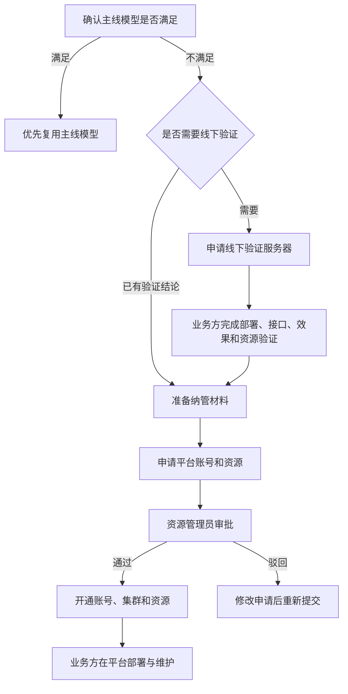
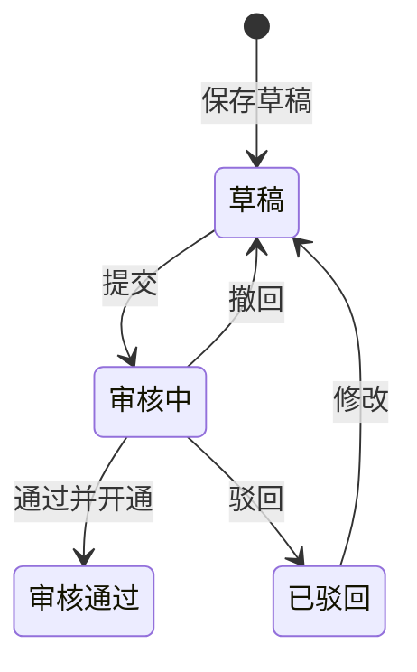
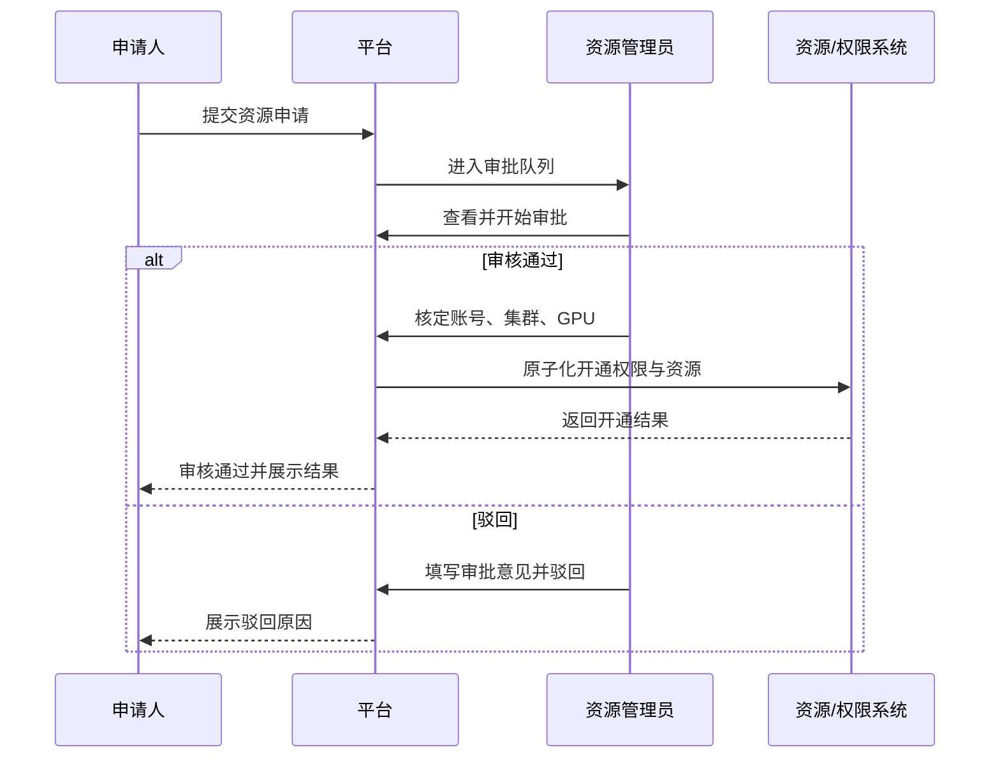

# 应龙大模型推理平台原型差异 PRD（V1 / V1.5）

## 3. 功能点列表

### 3.1 V1 功能点

| 功能模块 | 需求名称 | 差异需求 | 涉及端 |
| --- | --- | --- | --- |
| 全局框架 | NAV-01 导航重组 | 按工作台、算力调度、模型管理、资源与运维四组重建侧栏及激活态 | 前端 |
| 全局框架 | NAV-02 范围与用户入口 | 侧栏底部提供版本范围说明和用户入口 | 前端 |
| 全局框架 | NAV-03 旧路由兼容 | 为旧任务、API Key、模型仓库、集群和节点入口提供重定向或兼容 | 前端 |
| 系统概览 | OVR-01 核心 KPI | 新增在线节点、空闲 GPU/NPU、运行中模型 | 前后端 |
| 系统概览 | OVR-02 全域 QPS | 新增通用大模型、语音转写、小模型三类 QPS | 前后端 |
| 系统概览 | OVR-03 运行预警 | 新增节点异常、SLA 预警及目标页面跳转 | 前后端 |
| 系统概览 | OVR-04 预警规则配置 | 新增节点心跳、任务失败率、模型 SLA 阈值配置 | 前后端 |
| 系统概览 | OVR-05 显卡资源 | 改为按集群和显卡型号展示资源汇总及卡级明细 | 前端 |
| 系统概览 | OVR-06 模型排行榜 | 新增部署卡数、近一小时调用量两种排行 | 前后端 |
| 系统概览 | OVR-07 使用算力排行 | 新增按模型及在线/离线筛选的任务算力排行 | 前后端 |
| 算力调度 | DSP-02 在线/离线切换 | 新增在线、离线两种调度口径并同步刷新全页 | 前后端 |
| 算力调度 | DSP-03 资源与负载指标 | 改为展示硬件、实例、GPU 均值、Running/Waiting、近一小时调用数 | 前后端 |
| 算力调度 | DSP-04 在线任务列表 | 增加调用量、成功/失败数和推理延迟 | 前后端 |
| 算力调度 | DSP-05 离线任务列表 | 增加调度模式、当前算力权重、调用量、成功/失败数和推理延迟 | 前后端 |
| 算力调度 | DSP-06 调度趋势 | 标题修改，调整为输出吞吐和算力使用占比两类趋势 | 前端 |
| 任务管理 | TSK-01 页面重命名与合并 | “我的任务”改为“任务管理”，合并独立 API Key 能力 | 前端 |
| 任务管理 | TSK-02 组合筛选 | 增加类型、状态、模型组合筛选及重置 | 前后端 |
| 任务管理 | TSK-03 任务与密钥列表 | 增加申请人和创建人 | 前后端 |
| 任务管理 | TSK-04 创建信息显隐 | 增加创建人、创建时间辅助列开关 | 前端 |
| 任务管理 | TSK-05 注册/编辑任务 | 增加系统名称 | 前后端 |
| 任务管理 | TSK-06 任务启停与删除 | 操作入口按运行中、已停止状态重新收口 | 前后端 |
| 任务管理 | TSK-07 调用信息 | 将调用说明按模型类别集中到任务管理 | 前后端 |
| 调用日志 | LOG-01 任务切换 | 增加侧栏入口和有权限任务切换 | 前后端 |
| 调用日志 | LOG-02 统计指标 | 增加输入/输出 Tokens 及请求中、失败、拒绝口径 | 前后端 |
| 调用日志 | LOG-03 请求趋势 | 增加成功、失败、拒绝三类请求趋势 | 前后端 |
| 模型资产 | AST-01 资产卡片 | “模型仓库”改为“模型资产”，重排卡片字段和 V1 操作 | 前后端 |
| 模型资产 | AST-02 自动扫描规范 | 新增共享目录、命名、YAML 和目录结构说明 | 前端 |
| 模型资产 | AST-04 部署 YAML | 新增当前模型 YAML 的查看、修改和保存 | 前后端 |
| 模型服务 | SVC-01 服务筛选与列表 | 增加状态、类型、模型、节点IP 筛选 | 前后端 |
| 模型服务 | SVC-02 部署服务 | 修改指定节点的样式 | 前端 |
| 模型服务 | SVC-03 扩缩容/配置 | 运行中操作改为扩缩容，停止状态保留编辑 | 前端 |
| 模型服务 | SVC-04 启停与删除 | 操作入口按服务状态重新收口 | 前后端 |
| 模型监测 | MON-01 模型性能指标 | 同时展示所选模型的在线和离线核心指标卡 | 前后端 |
| 模型监测 | MON-02 资源使用维度 | 增加在线/离线、服务、节点筛选的 Pod 资源趋势 | 前后端 |
| 模型监测 | MON-03 按任务统计 | 增加任务调用量、失败数、推理延迟和下钻 | 前后端 |
| 资源申请 | APP-01 主线模型目录 | 新增可优先复用的通用、嵌入、重排模型目录 | 前后端 |
| 资源申请 | APP-02 纳管说明与材料 | 新增责任边界、规范下载、六步流程和材料清单 | 前后端 |
| 资源申请 | APP-03 线下验证服务器申请 | 新增短期独立服务器申请 | 前后端 |
| 资源申请 | APP-04 平台账号和资源申请 | 新增长期平台部署权限和资源申请 | 前后端 |
| 资源申请 | APP-05 我的申请 | 新增申请筛选、查看、编辑、提交和撤回 | 前后端 |
| 授权审批 | APR-01 审批工作台 | 新增资源管理员审批队列 | 前后端 |
| 授权审批 | APR-02 审批通过 | 新增账号、集群、GPU 核定和开通 | 前后端 |
| 授权审批 | APR-03 驳回申请 | 新增审批意见和驳回流程 | 前后端 |
| 授权审批 | APR-04 账号授权 | 新增授权查询及手工账号、集群授权 | 前后端 |
| 集群管理 | INF-01 集群切换与概览 | 合并集群列表和节点管理，同页切换集群上下文 | 前端 |

### 3.2 V1.5 功能点

| 功能模块 | 需求名称 | 差异需求 | 涉及端 |
| --- | --- | --- | --- |
| 链路追踪 | V15-TRC-01 链路追踪 | 新增请求链路查询、节点耗时、错误定位和上下游详情 | 前后端 |
| 模型训练 | V15-TRN-01 模型训练 | 新增训练任务、训练详情、训练记录及状态流 | 前后端 |
| 模型资产 | V15-AST-01 训练版本 | 新增版本历史、训练记录追溯及相关操作 | 前后端 |
| 模型资产 | V15-AST-02 添加模型资产 | 开放手工添加模型包、路径和元数据 | 前后端 |
| 模型资产 | V15-AST-03 编辑模型资产 | 开放资产元数据和路径编辑 | 前后端 |
| 模型资产 | V15-AST-04 版本数量 | 统计并展示每个模型资产的版本数量 | 前后端 |
| 模型服务 | V15-SVC-01 镜像选择 | 部署时支持填写镜像路径或从镜像仓库选择 | 前后端 |
| 调用日志 | V15-LOG-01 在线测试 | 支持填写参数、发送测试请求并查看响应与耗时 | 前后端 |
| 集群管理 | V15-INF-01 加速卡容量 | 集群概览增加可用卡数和总卡数 | 前后端 |
| 集群管理 | V15-INF-02 GPU 利用率 | 集群节点列表和节点详情增加 GPU 利用率 | 前后端 |
| 算力调度 | V15-DSP-01 请求数趋势 | 增加成功、失败、拒绝请求数趋势 | 前后端 |
| 调用日志 | V15-LOG-02 按天/按小时统计 | 增加统计粒度选择和对应明细表 | 前后端 |
| 集群管理 | INF-04 移除集群 | 增加依赖检查和完整名称二次确认 |  |
| 集群管理 | INF-05 节点列表 | 增加状态、IP 筛选并保留集群上下文 |  |
| 节点详情 | NOD-01 运行概览与实例 | 增加所属集群、GPU 容量、显存和服务信息 |  |
| 节点详情 | NOD-02 节点事件 | 增加事件名称、详情、原因搜索 |  |

## 4. 信息架构与路由

### 4.1 目标导航

| 分组 | V1 页面 | V1.5 页面 |
| --- | --- | --- |
| 工作台 | 系统概览 | 无 |
| 算力调度 | 算力调度、任务管理、调用日志 | 无 |
| 模型管理 | 模型资产、模型服务、模型监测 | 模型训练 |
| 资源与运维 | 资源申请、授权审批、集群管理 | 链路追踪 |

### 4.2 路由迁移建议

| 当前路由 | 目标页面 | 要求 |
| --- | --- | --- |
| `/brief` | 系统概览 | 保留路径，重构页面 |
| `/computing` | 算力调度 | 保留路径，重构数据和交互 |
| `/task` | 任务管理 | 保留兼容，修改名称和页面 |
| `/task-details/:id` | 调用日志 | 保留下钻，并新增可直接访问的导航入口 |
| `/api-key` | 合并到任务管理 | 从导航移除；旧地址重定向 |
| `/model-repositity` | 模型资产 | 保留 |
| `/model-service` | 模型服务 | 保留 |
| `/model-monitor` | 模型监测 | 保留 |
| `/cluster-list`、`/node-list` | 集群管理 | 合并入口， |
| `/node-details/:id` | 节点详情 | 保留为集群管理下钻 |
| 无 | 资源申请、授权审批 | 新增 V1 路由、菜单、权限 |
| 无 | 模型训练、链路追踪 | V1.5 新增路由；V1 生产菜单不显示可操作入口 |

### 4.3 公共交互

- 筛选区统一按“搜索—业务筛选—结果数—重置”组织。
- 修改筛选条件后回到第 1 页；翻页保留筛选条件。
- 表格支持 10/20/50 条每页，展示总数和页码；
- 加载中、空数据、接口失败、无权限、提交中、提交成功必须有明确状态。
- 停止、删除、驳回、撤回、移除集群等操作必须有影响说明和二次确认。
- 状侧栏底部常态展示后端版本；鼠标悬停或键盘聚焦后展示前端、后端完整版本。原型示例均为 `v1.0.0`，生产值必须来自构建信息或版本接口，不得写死。
- 版本信息加载失败时显示 `--` 并保留可诊断错误，不得阻断业务页面加载。

## 5. 需求详情

### 5.1 系统概览

#### 5.1.1 页面说明

- 页面位置：工作台 > 系统概览。
- 当前差异：当前版的“显卡详情、集群节点状态、模型实例分布、各任务算力占比”需重构为原型中的 KPI、QPS、预警、卡级资源、模型排行和算力排行。

#### 5.1.2 差异字段

| 字段名 | 是否必填 | 是否可改 | 类型 | 输入方式 | 默认值 | 值 | 备注 |
| --- | --- | --- | --- | --- | --- | --- | --- |
| 在线节点 | 是 | 否 | 整数 | 系统汇总 | -- | 大于等于 0 | 可附异常节点数 |
| 空闲 GPU/NPU | 是 | 否 | 整数 | 系统汇总 | -- | 空闲卡数 | GPU、NPU 口径需统一 |
| 运行中模型 | 是 | 否 | 整数 | 系统汇总 | -- | 大于等于 0 | 按运行中服务去重模型 |
| 模型类别 QPS | 是 | 否 | 数值 | 系统汇总 | -- | req/hour | 通用、语音转写、小模型 |
| 集群 | 否 | 是 | 枚举 | 下拉选择 | 全部集群 | 集群字典 | 影响显卡资源区 |
| 显卡型号 | 否 | 是 | 枚举 | 型号卡切换 | 首个可用型号 | GPU/NPU 型号 | 与集群联动 |
| 卡级明细 | 是 | 否 | 列表 | 系统查询 | 空 | 唯一 ID、节点 IP、实例、GPU、显存、功率 | 无数据展示空状态 |
| 排行指标 | 是 | 是 | 枚举 | 页签切换 | 当前部署卡数 | 部署卡数/近一小时调用量 | 影响模型排行榜 |

#### 5.1.3 差异功能

1. 顶部展示在线节点、空闲 GPU/NPU、运行中模型。
2. “分模型类别全域 QPS”按三类模型分别展示，不得把离线批量任务折算为在线 QPS。
3. “运行预警”至少区分节点异常和 SLA 预警；点击模型预警跳转模型监测并带入模型及时间范围。
4. 显卡资源显示已用/总卡、空闲卡、总台数、已分配卡数、空闲卡数、高水位卡数及卡级明细。
5. 删除当前版“集群节点状态、模型实例分布”独立区块

#### 5.1.4 模型排行榜和使用算力排行

模型排行榜：

| 项目 | 差异需求 |
| --- | --- |
| 排行指标 | 提供“当前部署卡数”和“近一小时调用量”切换，默认当前部署卡数 |
| 展示字段 | 排名、模型名称、指标条、指标值和单位；部署量单位为“卡”，调用量单位为“次” |
| 排序 | 按指标值倒序；数值相同时按模型名称稳定排序，翻页后排名连续 |
| 分页 | 每页 5 条，显示当前范围、总数、页码、上一页和下一页 |
| 指标切换 | 切换后回到第 1 页，仅刷新排行榜；加载失败保留上一次成功数据并提示重试 |
| 时间口径 | “近一小时调用量”按查询时点向前滚动 60 分钟，接口返回窗口起止时间和数据时间 |

使用算力排行：

| 项目 | 差异需求 |
| --- | --- |
| 筛选条件 | 必选模型；服务类型在“在线/离线”间切换，默认在线 |
| 展示字段 | 任务名称、算力使用量、使用占比、相对长度条 |
| 排序 | 按算力使用量倒序；切换模型或服务类型后回到第 1 页 |
| 分页 | 每页 5 条，显示当前范围、总数、页码、上一页和下一页 |
| 数值口径 | 后端同时返回原始值、展示单位和占比。 |
| 空值处理 | 无任务时显示空状态；分母为 0 时占比显示 `--`，不显示 0% 进度条 |
| 统计窗口 | 近一小时按查询时点向前滚动 60 分钟 |

#### 5.1.5 差异操作验证规则

| 按钮/操作 | 前置条件 | 后置结果 | 异常与提示 |
| --- | --- | --- | --- |
| 预警项 | 目标对象存在 | 跳转节点详情或模型监测并带入上下文 | 对象已删除时提示数据已失效 |
| 预警规则配置 | 有配置权限 | 打开当前规则 | 无权限时隐藏入口，接口仍需鉴权 |
| 保存预警规则 | 必填且阈值合法 | 保存并刷新规则摘要 | 字段旁展示具体错误；失败不关闭弹窗 |
| 切换模型排行指标 | 排行数据可查询 | 回到第 1 页并按新指标倒序展示 |  |
| 切换算力排行模型/类型 | 模型有效 | 回到第 1 页并刷新任务排行 |  |

### 5.2 算力调度

#### 5.2.1 页面说明

- 页面位置：算力调度 > 算力调度。
- 操作人：资源管理员、调度管理员、运维人员。
- 当前差异：当前版按目标模型选择，并展示显卡、理论算力、实例数、显存；目标态改为按“调度域 + 在线/离线”观察资源供给、请求负载、任务和趋势。

#### 5.2.2 差异字段

| 字段名 | 是否必填 | 是否可改 | 类型 | 输入方式 | 默认值 | 值 | 备注 |
| --- | --- | --- | --- | --- | --- | --- | --- |
| 调度类型 | 是 | 是 | 枚举 | 在线/离线切换 | 在线 | online/offline | URL 可恢复 |
| 硬件资源 | 是 | 否 | 数组 | 系统查询 | 空 | 型号×数量 | 在线/离线分别统计 |
| 实例数 | 是 | 否 | 整数 | 系统查询 | -- | 大于等于 0 | 当前域当前类型 |
| 平均 GPU 利用率 | 是 | 否 | 百分比 | 系统查询 | -- | 近一小时 | 单位契约统一 |
| Running/Waiting | 是 | 否 | 整数对 | 系统查询 | -- | 请求数 | 不合并展示 |
| 总调用数 | 是 | 否 | 整数 | 系统查询 | -- | 近一小时 | 原型运行态口径 |
| 当前算力权重 | 离线是 | 否 | 百分比 | 系统查询 | -- | 0%～100% | 不得出现 2000% |

在线任务列：任务 ID、任务名称、任务状态、类型、总调用数、成功调用数、调用失败数、推理延迟、操作。

离线任务列：任务 ID、任务名称、任务状态、调度模式、类型、当前算力权重、总调用数、成功调用数、调用失败数、推理延迟、操作。

#### 5.2.6 现有接口改造【AI生成，未review，仅供参考】

| 现有接口 | 当前数据 | 需要增加或调整 | 改造方式 |
| --- | --- | --- | --- |
| `GET /model/repository/dashboard/{id}` | 按模型 ID 返回显卡、卡数、实例、TPS、KV Cache、GPU 利用率和请求负载 | 目标主维度改为调度域与在线/离线，原路径不再适合承载新首页 | 原接口保留给旧页面；新增 `GET /dispatch/overview`，入参为 `dispatchDomainId`、`dispatchType`，返回硬件资源、实例数、GPU 均值、Running、Waiting、近一小时调用数和 `dataTime` |
| `GET /through/getQueuePoolsThroughByModelId` | 按模型返回 Online/Public/Vip 吞吐序列 | 增加调度域、在线/离线和时间范围；序列增加任务 ID、任务名称、输出 Tokens 与单位 | 建议迁移为 `GET /dispatch/output-throughput`；旧接口保留一版兼容，避免继续叠加与路径名不符的参数 |
| `GET /through/getTaskChartByModelId` | 返回任务等待时间、算力占比和 Token 数 | 增加调度域、调度类型；统一返回 `sharePercent` 数值和时间点 | 新增 `GET /dispatch/compute-share`；百分比制式统一为 0～100，前端不再乘 100 |
| `POST /reasoning_task/taskAdjustmentList` | 调度任务基本信息、权重、队列积压和预计时间 | 入参增加 `dispatchDomainId`、`dispatchType`、`searchKey`；响应增加 `taskId`、`scheduleMode`、`totalCalls`、`successCount`、`failureCount`、`latencyMs` | 保留分页结构，在现有请求/响应上增量扩展；在线任务不返回可编辑权重 |
| `GET /reasoning_task/getComputingPower/{id}` | GPU、容器、Pod、节点和服务信息 | 增加稳定的实例 ID、节点 ID、显存单位和分配状态 | 保留原字段，新增字段供“查看算力”展示；空数组表示尚未分配 |
| `GET /reasoning_task/configComputingResource`、`calculateVipRatioImpact`、`upgradeToVipQueue` | 当前权重、影响模拟和 VIP 调整 | 统一增加 `scheduleMode`、`configVersion`，提交接口区分升级、降级并校验权重上限 | 现有 downgrade 仍调用 upgrade 地址，需拆为统一保存接口或明确 action；用 `configVersion` 防止并发覆盖 |

### 5.3 任务管理

#### 5.3.1 页面说明

- 页面位置：算力调度 > 任务管理。
- 操作人：任务申请人、任务管理员、平台管理员。
- 当前差异：当前“我的任务”及独立“API Key 管理”合并。原三项任务统计卡不在目标原型中。

#### 5.3.2 列表差异字段

| 字段名 | 是否必填 | 是否可改 | 类型 | 输入方式 | 默认值 | 值 | 备注 |
| --- | --- | --- | --- | --- | --- | --- | --- |
| 类型 | 否 | 是 | 枚举 | 筛选 | 全部 | 在线/离线 | 可组合 |
| 密钥 | 是 | 否 | 敏感字符串 | 脱敏展示 | `sk-****` | API Key | 列表接口不得返回完整值 |
| 创建人/时间 | 是 | 否 | 用户/时间 | 系统查询 | 隐藏 | 创建审计 | 由前端开关控制列 |

#### 5.3.3 注册/编辑差异字段

| 字段名 | 是否必填 | 是否可改 | 类型 | 输入方式 | 默认值 | 值 | 备注 |
| --- | --- | --- | --- | --- | --- | --- | --- |
| 系统名称 | 是 | 是 | 枚举 | 下拉 | 空 | 智能体1～12、智能体平台、数字基座等 | 应由后端字典维护 |

#### 5.3.4 调用信息

模型类别及基础路径：

| 模型类别 | 路径 |
| --- | --- |
| 通用大模型 | `/v1/chat/completions` |
| 语音转写模型 | `/asr/recognition` |
| 小模型 | `/SmallModel/` |

调用信息抽屉/弹窗必须展示请求地址、复制地址、接口参数、查看参数、下载 JSON、API Key 鉴权位置、复制 API Key，以及 cURL、Python、Postman 示例和复制按钮。

### 5.4 调用日志

#### 5.4.1 页面说明

- 页面位置：算力调度 > 调用日志；也可从任务管理、算力调度、模型监测下钻。
- 操作人：任务申请人、任务管理员、运维人员。
- 当前差异：移除重复的调用集成信息；增加导航入口、任务切换、修改了部分请求指标。

#### 5.4.2 差异字段

| 字段名 | 是否必填 | 是否可改 | 类型 | 输入方式 | 默认值 | 值 | 备注 |
| --- | --- | --- | --- | --- | --- | --- | --- |
| 任务名称 | 是 | 是 | 枚举 | 下拉 | 路由任务/首个任务 | 有权限任务 | 切换刷新全页 |
| 请求指标 | 是 | 否 | 整数 | 系统统计 | -- | Tokens、总数、中、成功、失败、拒绝 | |

请求日志列：创建时间、Request ID、请求输入、请求输出、状态、输入 Tokens、输出 Tokens、总耗时。

#### 5.4.6 现有接口改造【AI生成，未review，仅供参考】

| 现有接口 | 当前数据 | 需要增加或调整 | 改造方式 |
| --- | --- | --- | --- |
| `GET /reasoning_task/getReasoningTaskByTaskId` | 返回当前任务和关联模型 | 调用日志侧栏直达后需要任务选择项 | 原详情接口保留；新增轻量 `GET /reasoning_task/options` 返回有权限的任务 ID、名称、模型 ID/名称，避免用完整任务列表替代下拉数据源 |
| `POST /reasoning_task/getTaskDetail` | 输入/输出 Tokens、模型 Tokens、算力占比、请求总数及成功/失败趋势 | 增加 `processingCount`、`successCount`、`failureCount`、`rejectedCount`、`dataTime`；趋势增加 `rejectedCount` | 保留现有 Tokens 字段；`computingResourceProportion` 不再用于新页面。请求总数公式由后端统一计算并写入接口文档 |
| `POST /model_api_log/newQueryByTaskId` | 支持分页、任务、模型、状态、起止时间；状态码 0/1/2/3 含义不清 | 状态改为 `PROCESSING/SUCCESS/FAILED/REJECTED`，列表增加 `resultType`、`errorCode`、`hasDetail` | 迁移期可同时返回 `statusCode` 与 `status`；前端只按新枚举渲染，不再把“队列中”和“拒绝”混为一类 |
| `POST /model_api_log/queryLogDetailByRequestId` | 返回完整输入、输出、Tokens 和耗时 | 增加 `errorMessage`、`rejectReason`、`traceId`、`maskedFields` | 根据日志状态返回对应详情；服务端完成敏感字段脱敏，不向前端返回堆栈和凭证 |
| `GET /reasoning_task/getChatExampleByTaskId` | 调用示例位于当前详情页 | V1 调用日志不再展示集成说明 | 接口由任务管理调用，调用日志页面移除请求；V15-LOG-01 的在线测试另设受控测试接口 |

V15-LOG-02 需要独立的 `granularity=DAY/HOUR` 入参和明细返回结构；V1 的统计接口不接受该参数。

### 5.5 模型资产

#### 5.5.1 页面说明

- 页面位置：模型管理 > 模型资产。
- 操作人：模型管理员、平台管理员。
- 当前差异：当前“模型仓库”卡片显示可用状态、版本和参数量；目标卡片显示名称、描述并提供部署 YAML、部署服务，其他资产编辑能力不进 V1。

#### 5.5.2 自动扫描规范

| 字段 | 目标值 |
| --- | --- |
| 共享目录 | `/data/yl/modelPath` |
| 目录命名 | `yl-model_{modelName}_{version}` |
| 部署配置 | `{modelName}_{version}.yaml` |
| 示例 | 模型目录内包含 YAML、权重及相关文件 |

#### 5.5.3 卡片操作字段

| 字段名 | 是否必填 | 是否可改 | 类型 | 输入方式 | 默认值 | 值 | 备注 |
| --- | --- | --- | --- | --- | --- | --- | --- |
| YAML 配置 | 是 | 是 | 多行文本 | 代码编辑器 | 当前文件 | 合法 YAML | 支持横纵滚动 |
| 路由配置 |  |  |  |  |  |  |  |

#### 

### 5.6 模型服务

#### 5.6.1 页面说明

- 页面位置：模型管理 > 模型服务。
- 操作人：模型管理员、服务运维人员。
- 当前差异：目标列表增加部署节点与节点 IP 筛选；当前“配置”在运行中目标态改为“扩缩容”。

#### 5.6.2 列表差异字段

| 字段名 | 是否必填 | 是否可改 | 类型 | 输入方式 | 默认值 | 值 | 备注 |
| --- | --- | --- | --- | --- | --- | --- | --- |
| 搜索 | 否 | 是 | 字符串 | 搜索框 | 空 | 名称/模型/节点 IP | |
| 节点 IP | 否 | 是 | 枚举/搜索 | 下拉 | 全部 | 有权限节点 | |
| 服务名称 | 是 | 否 | 字符串 | 系统查询 | -- | 名称及 ID | 同单元格主副信息 |
| 模型 | 是 | 否 | 字符串 | 系统查询 | -- | 模型及版本 | |
| 部署节点 | 是 | 否 | 数组 | 系统查询 | 空 | 节点 IP 列表 | 不得截断丢失 |

#### 5.6.3 部署服务差异字段

| 字段名 | 是否必填 | 是否可改 | 类型 | 输入方式 | 默认值 | 值 | 备注 |
| --- | --- | --- | --- | --- | --- | --- | --- |
| 镜像 | 否 | 否 | 平台配置 | 系统注入 | 默认镜像 | 镜像地址 | V1 版本不增加，V1.5增加 |
| 节点指定 | 是 | 是 | 枚举 | 单选 | 自动调度 | 自动/指定 | 指定时增加节点字段 |
| 指定节点 | 条件必填 | 是 | 多选 | 下拉 | 空 | 匹配节点 | 只列可用节点 |

### 5.7 模型监测

#### 5.7.1 页面说明

- 页面位置：模型管理 > 模型监测。
- 操作人：模型管理员、运维人员、任务管理员。
- 5.7.2 差异字段

| 字段名 | 是否必填 | 是否可改 | 类型 | 输入方式 | 默认值 | 值 | 备注 |
| --- | --- | --- | --- | --- | --- | --- | --- |
| 性能指标卡 | 是 | 否 | 对象 | 系统查询 | 空 | 在线卡、离线卡 | 两张卡同时展示 |
| 资源模式 | 是 | 是 | 枚举 | 在线/离线切换 | 在线 | online/offline | 影响详细维度 |
| 详细维度 | 是 | 是 | 枚举 | 页签 | 资源使用 | 资源/任务/服务 | |
| 模型服务 | 否 | 是 | 枚举 | 下拉 | 全部 | 当前模型服务 | 资源维度 |
| 节点 IP | 否 | 是 | 枚举 | 下拉 | 全部 | 当前实例节点 | 资源维度 |

性能指标卡：总调用数量、调用失败数、失败率、平均推理延迟、Running/Waiting、KV Cache 占用。

按任务列：任务名称/ID、任务类型、调用数量、调用失败数、推理延迟、操作。

按服务列：模型服务、服务类型、实例名称、节点 IP、Running/Waiting、KV Cache。

#### 5.7.3 操作验证规则

| 按钮/操作 | 前置条件 | 后置结果 | 异常与提示 |
| --- | --- | --- | --- |
| 应用筛选 | 模型、时间合法 | 刷新两张性能卡和当前详细维度 | 单模块失败局部提示 |
| 在线/离线 | 已选择模型 | 切换详细维度数据 | 顶部两张概览卡保持可比较 |
| 资源/任务/服务页签 | 数据已加载 | 切换维度并保留筛选 | 无数据展示对应空状态 |
| 重置资源筛选 | 有服务或节点条件 | 恢复全部服务、节点 | 不重置模型与时间 |
| 任务详情 | 任务存在且有权限 | 进入调用日志并带入任务 | 无权限提示 |

### 5.8 资源申请

#### 5.8.1 页面说明

- 页面位置：资源与运维 > 资源申请。
- 页面 H1：资源申请。
- 操作人：业务申请人、模型接入负责人。

页面由主线模型目录、非主线模型责任说明、纳管规范下载、六步纳管流程、部署资源申请、我的申请和接入材料清单组成。

#### 5.8.2 两类申请字段

| 字段名 | 线下验证 | 平台账号和资源 | 是否可改 | 类型/输入 | 规则 |
| --- | --- | --- | --- | --- | --- |
| 申请名称 | 必填 | 必填 | 是 | 输入框 | 草稿至少需填写此项 |
| 申请部门/项目组 | 必填 | 必填 | 是 | 输入框/组织选择 | 建议接组织字典 |
| 业务系统 | 必填 | 必填 | 是 | 输入框/系统字典 | |
| 申请人 | 必填 | 必填 | 否 | 当前用户 | 管理员代申请规则待确认 |
| 部署操作人 | 必填 | 必填 | 是 | 用户选择 | |
| 资源用途 | 必填 | 必填 | 是 | 文本域 | 最多 1000 字 |
| 模型名称 | 否 | 必填 | 是 | 输入/模型字典 | 非主线模型可输入 |
| 资源使用时间 | 必填 | 否 | 是 | 起止时间 | 开始早于结束 |
| GPU 型号 | 必填 | 必填 | 是 | 下拉 | 910B4/L40/A10/不限制等 |
| GPU 数量 | 必填 | 必填 | 是 | 正整数 | 大于等于 1 |
| 是否完成线下验证 | 否 | 必填 | 是 | 下拉 | 已验证/直接评审 |
| 预计并发 | 否 | 非必填 | 是 | 非负数值 | 建议明确单位 |
| 计划上线时间 | 否 | 非必填 | 是 | 日期时间 | 不早于提交时间 |

#### 5.8.3 申请列表

筛选：关键字、类型（线下验证服务器/平台账号和资源）、状态（草稿/审核中/审核通过等）、重置。

列：申请名称及编号、类型、业务系统、申请人、资源需求、状态、更新时间、操作。

#### 5.8.4 业务流程

申请状态：

#### 5.9 授权审批

#### 5.9.1 页面说明

- 页面位置：资源与运维 > 授权审批。
- 当前差异：当前版无对应模块，为全新高权限能力。

#### 5.9.2 审批与授权字段

审批列表列：申请名称/编号、类型、业务系统、申请人、状态、授权集群、授权 IP、操作。

| 字段名 | 平台资源审批 | 线下服务器审批 | 是否必填 | 输入方式 | 规则 |
| --- | --- | --- | --- | --- | --- |
| 授权账号 | 是 | 可选/不适用 | 是 | 可搜索账号 | 必须选择有效账号 |
| 授权集群 | 是 | 按实现确定 | 是 | 下拉 | 只显示管理员有权集群 |
| 核定 GPU 型号 | 是 | 是 | 是 | 下拉 | 来自选中集群 |
| 核定 GPU 数量 | 是 | 是 | 是 | 正整数 | 不超过实时可用量 |
| 授权 IP/服务器 IP | 可由节点产生 | 是 | 条件必填 | IP 输入/选择 | IPv4/IPv6 规则需冻结 |
| 有效期 | 按权限策略 | 是 | 条件必填 | 时间范围 | 线下服务器必须有结束时间 |
| 审批意见 | 通过可选 | 驳回必填 | 条件必填 | 文本域 | 驳回建议 10～500 字 |

账号授权列表列：授权账号、授权集群、授权 IP、授权时间、状态。

手工新增授权字段：授权账号、授权集群；如最终需要授权范围/节点，应在评审后补充。

#### 5.9.3 审批流程

#### 5.9.4 操作验证规则

| 按钮 | 前置条件 | 后置结果 | 异常与提示 |
| --- | --- | --- | --- |
| 审批 | 状态为审核中，有审批权限 | 打开申请详情与核定表单 | 已被他人处理时只读 |
| 审核通过 | 核定字段合法、资源实时足够 | 申请通过并生成授权记录 | 开通失败不得显示通过；支持重试/补偿 |
| 驳回申请 | 申请仍可处理 | 切换到审批意见表单 | 无 |
| 确认驳回 | 审批意见合法 | 状态转已驳回 | 空原因禁止提交 |
| 新增授权 | 有账号授权权限 | 打开账号与集群表单 | 无 |
| 确认授权 | 账号、集群有效 | 创建授权记录并记录操作者/时间 | 重复授权应阻止或幂等 |

## 7. 权限与安全

| 能力 | 权限 |
| --- | --- |
| 查看平台概览/调度/模型监测 | 普通用户（三级）、模型工程师（二级）、管理员（一级） |
| 创建/编辑/启停任务/查看/复制完整 API Key | 普通用户（三级）、模型工程师（二级）、管理员（一级） |
| 部署/扩缩容/启停服务 | 模型服务管理员（二级）、管理员（一级） |
| 提交/撤回资源申请 | 普通用户（三级）、模型工程师（二级）、管理员（一级） |
| 审批申请/核定资源 | 管理员（一级） |
| 手工账号授权 | 管理员（一级） |
| 注册、配置、移除集群 | 管理员（一级） |
| 算力调度页面 | 管理员（一级） |

## 10. 待确认事项

| 编号 | 问题 | 建议/当前假设 | 影响 |
| --- | --- | --- | --- |
| Q-01 | V1.5 的 12 个功能点一次发布还是分批交付？ | 建议按训练/追踪、模型服务、监控统计三组拆分排期 | 里程碑和联调顺序 |
| Q-02 | V1 生产环境是否显示带“V1不含”标签的 V1.5 入口/按钮？ | 建议隐藏业务入口，仅在范围说明展示 | 导航与误操作风险 |
| Q-03 | 调用日志返回文案及个别旧静态导航仍写“密钥管理/我的任务”，是否统一为“任务管理”？ | 建议全部统一为“任务管理” | 页面文案、自动化定位、帮助文档 |
| Q-04 | 独立 API Key 页面是否彻底下线？原统计卡是否保留？ | 建议合并并重定向 | 路由和历史书签 |
| Q-05 | 已提交和审核中是否为两个状态？ | 本文按两个状态 | 状态机、撤回时点 |
| Q-06 | 调用日志的请求总数是否包含请求中？ | 接口冻结公式 | KPI 和测试断言 |
| Q-07 | 模型服务部署中、失败、停止中如何展示？ | 建议保留真实中间/异常态 | 运维可见性 |
| Q-08 | 自定义端口范围采用 1024～65535 还是 30000～32767？ | 以后端网络安全规则为准 | 前后端校验 |
| Q-09 | 部署高级 YAML 与可视化字段谁覆盖谁？ | 建议单一数据源实时同步 | 配置一致性 |
| Q-10 | 资源申请、审批的数据可见范围和角色矩阵？ | 最小权限、本人数据优先 | 数据隔离 |
| Q-11 | 审批通过时可调整哪些申请值，是否支持部分批准？ | 原型只体现核定 GPU | 审批模型 |
| Q-12 | 手工账号授权是否需要节点/权限范围和有效期？ | 建议补充 | 安全与回收 |
| Q-13 | “配置集群”具体可编辑字段是什么？ | 原型未展开，开发前补齐 | 集群配置页面 |
| Q-14 | 当前概览的集群状态、模型实例分布是否确认下线？ | 暂按目标原型替换 | 信息完整性 |
| Q-15 | 模型、系统、集群、GPU 类型是否全部由后端字典维护？ | 建议统一字典 | 配置维护 |
| Q-16 | 后端版本接口是否允许登录前访问，缓存多久？ | 建议允许匿名只读，缓存不超过 5 分钟 | 登录页诊断、版本定位 |
| Q-17 | 使用算力排行采用哪个统计窗口？ | 建议与近一小时调用量统一为滚动 60 分钟 | 排行结果、接口缓存、测试数据 |
